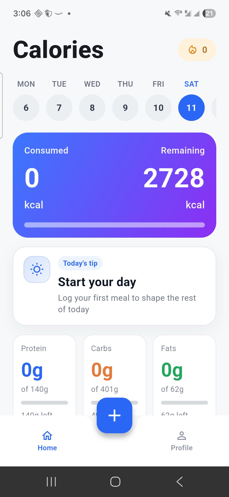

# AI Calorie Tracker

AI Calorie Tracker is a Flutter nutrition-tracking app focused on fast meal logging, AI-assisted food analysis, and daily progress that feels structured instead of noisy.

## At a Glance

- Flutter mobile app for nutrition tracking
- AI-powered photo meal logging
- Personalized calorie and macro targets
- Session-based meal history instead of a flat log

## Core Features

- Personalized onboarding that calculates calorie and macro targets.
- Photo-based meal logging from camera or gallery.
- Clarification flow for ambiguous dishes before final analysis.
- Portion confirmation flow when the backend needs user input or an AI-estimate confirmation.
- Home dashboard with calorie progress, macro progress, a deterministic daily tip, and latest meal summary.
- Manual meal add/edit flow with realtime nutrition recalculation.
- Session-based history grouped into breakfast, lunch, dinner, and snacks.
- Local persistence for onboarding and meal data with `SharedPreferences`.

## Why This Project Is Technically Interesting

- AI uncertainty is handled as product UX, not just an API call.
- Session-based meal history adds structure beyond a flat calorie log.
- Manual meal editing includes linked nutrition logic and conflict handling.
- Critical product flows are covered by focused tests.

## Product Highlights

### Photo logging that handles ambiguity well

The photo flow is not just "upload image -> show result." The client supports a second clarification step for mixed or unclear dishes, then handles backend-driven portion confirmation when the estimate is uncertain.

That turns AI food recognition into a usable product flow instead of a single optimistic API call.

### Session-aware history instead of a noisy feed

Meals are grouped into sessions using time proximity and classified into meal categories with threshold-aware tiering. The result is a day view that feels easier to interpret than a raw chronological list of entries.

### Manual editing with real product logic

The manual meal form supports linked calories/macros behavior, session-scoped field locking, reset and restore flows, and conflict handling when user-entered values do not reconcile cleanly.

## Product Flow

<p align="center">
  
</p>

<p align="center">
  A quick walkthrough of onboarding, meal entry, AI clarification, portion confirmation, and session-based history.
</p>

## Screenshots

<table>
  <tr>
    <td align="center" width="33%">
      
      <br />
      <strong>Personalized onboarding</strong>
      <br />
      Users start by choosing a goal and building a nutrition plan around it.
    </td>
    <td align="center" width="33%">
      
      <br />
      <strong>Detailed profile inputs</strong>
      <br />
      Age, height, weight, and unit preferences are captured before plan calculation.
    </td>
    <td align="center" width="33%">
      
      <br />
      <strong>Activity-based planning</strong>
      <br />
      Daily targets adapt to the user's typical activity level and training rhythm.
    </td>
  </tr>
  <tr>
    <td align="center" width="33%">
      
      <br />
      <strong>Daily progress dashboard</strong>
      <br />
      The home screen surfaces calories, macros, and a deterministic daily tip at a glance.
    </td>
    <td align="center" width="33%">
      
      <br />
      <strong>Flexible meal entry</strong>
      <br />
      Meals can start from a photo, the gallery, or a full manual form.
    </td>
    <td align="center" width="33%">
      
      <br />
      <strong>AI clarification step</strong>
      <br />
      Ambiguous dishes get a fast hint-based UX instead of forcing a blind estimate.
    </td>
  </tr>
  <tr>
    <td align="center" width="33%">
      
      <br />
      <strong>Portion confirmation</strong>
      <br />
      The app can ask for a precise serving size or let the user keep the AI estimate.
    </td>
    <td align="center" width="33%">
      
      <br />
      <strong>Editable final meal data</strong>
      <br />
      Users can review and refine calories, macros, weight, and meal type before saving.
    </td>
    <td align="center" width="33%">
      
      <br />
      <strong>Session-based history</strong>
      <br />
      Saved meals are grouped into breakfast, lunch, dinner, and snacks instead of a flat feed.
    </td>
  </tr>
</table>

## Architecture Overview

This repository is the Flutter client. It owns:

- onboarding and nutrition-plan calculation
- app shell and UI
- local persistence
- meal sessionization and timeline logic
- manual meal editing behavior
- backend integration for photo-food analysis

The backend is a separate service and is used here as an API dependency, not embedded in this repository.

Core frontend flow:

`Onboarding -> nutrition targets -> meal logging -> local persistence -> session rebuild -> daily progress UI`

Photo flow:

`Camera/Gallery -> clarification (optional) -> backend analysis -> portion confirmation (optional) -> save meal -> refresh dashboard/history`

For the deeper engineering and AI-agent reference, see [docs/agent_guide.md](docs/agent_guide.md).

## Tech Stack

- Flutter
- Dart `^3.11.0`
- Material 3
- `http`, `http_parser`, `mime`
- `image_picker`
- `shared_preferences`

## Repository Structure

```text
lib/
  main.dart            app bootstrap, shell, home screen, add/edit meal flows
  onboarding.dart      onboarding UI and nutrition-plan calculation
  meal_session.dart    session grouping, thresholds, tiering, overrides
  meal_type.dart       meal classification by time window
  home_coach.dart      deterministic daily-tip heuristics and messaging
  photo_food/          API client, models, controller, repository abstractions
  profile/             profile and account/settings screens
docs/
  agent_guide.md       canonical engineering + AI-agent reference
  MEAL_EDIT_AUTO_CALC.md
test/
  widget and unit tests for key product behavior
```

## API Integration

The app currently integrates with a separate backend through:

- `POST /v0/ai/photo-food`
- `POST /v0/ai/photo-food/confirm-portion`

Auth/config used by the client:

- header: `X-API-Key`
- compile-time config:
  - `API_BASE_URL`
  - `API_KEY`

## Setup

Prerequisites:

- Flutter SDK
- a running compatible backend for photo-food analysis
- values for `API_BASE_URL` and `API_KEY`

Run locally:

```bash
flutter pub get
flutter run \
  --dart-define=API_BASE_URL=http://<backend-host>:8000 \
  --dart-define=API_KEY=<PHOTO_FOOD_API_KEY>
```

Build examples:

```bash
flutter build apk --release \
  --dart-define=API_BASE_URL=https://<backend-host> \
  --dart-define=API_KEY=<PHOTO_FOOD_API_KEY>

flutter build ios --release \
  --dart-define=API_BASE_URL=https://<backend-host> \
  --dart-define=API_KEY=<PHOTO_FOOD_API_KEY>
```

## Validation

```bash
flutter test
```

The current test coverage focuses on:

- onboarding behavior
- meal-type boundaries
- session grouping and override behavior
- API parsing and validation
- clarification and portion-confirmation flows
- manual meal auto-calc and lock behavior

## Current Limitations

- Photo analysis depends on a separate backend service.
- API configuration is passed through `--dart-define` values at build/run time.
- A large amount of orchestration and UI logic still lives in `lib/main.dart`.
- Persistence is local-only and uses `SharedPreferences`, not a richer local database.
- Deployment is currently a manual Flutter build flow with no CI/CD pipeline in this repo.
- Some profile surfaces are presentational rather than fully backed by real historical analytics.

## Next Improvements

- Extract more home/add/edit logic out of `lib/main.dart`.
- Improve production configuration and environment strategy.
- Expand test coverage around persistence and profile behavior.
- Continue separating product-facing and engineering-facing documentation.

## License

This repository is source-available under [PolyForm Noncommercial 1.0.0](LICENSE). Commercial use is not permitted under this license without separate permission from the repository owner.

## My Role

I built the project independently, including the Flutter client architecture, onboarding flow, AI-assisted meal logging UX, manual meal editing behavior, local persistence model, session-based history logic, backend API integration, and test coverage around the most product-critical flows.
